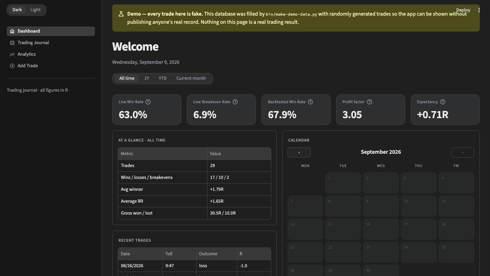
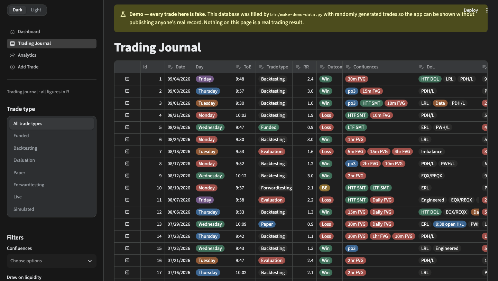
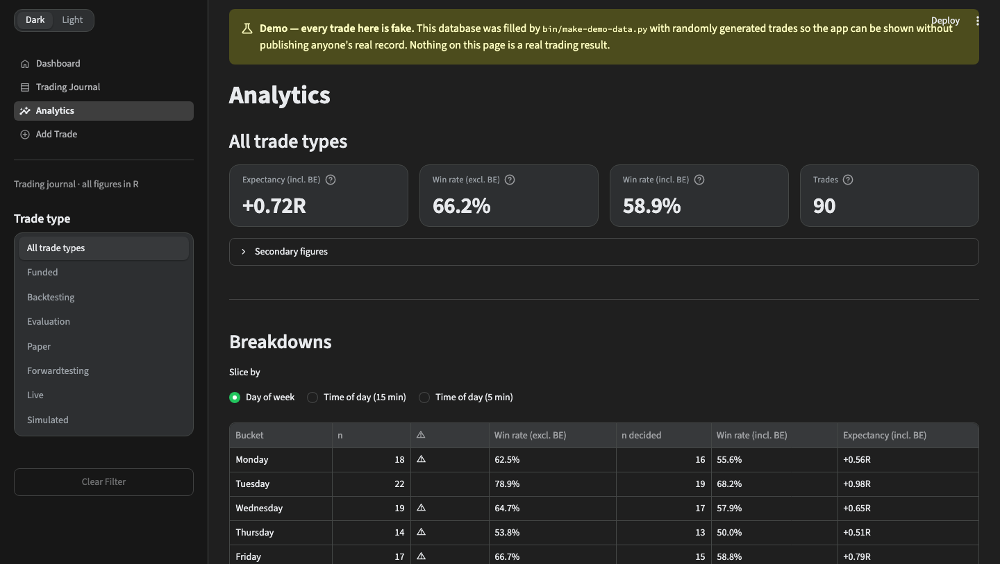

# Trading Journal

A local, single-user day-trading journal. Python + SQLite + Streamlit. Runs on
your machine, stores one file, talks to nothing.

**Everything is measured in R.** No entry or exit prices, no dollar P&L, no
equity curve. A win is your planned R:R, a loss is −1R, a breakeven is 0R. The
point is to review the *inputs* — the setup, the time of day, the state you were
in — rather than watching a balance.

> **The screenshots below use generated fake data.** Every trade in them came
> out of `bin/make-demo-data.py`. Nothing here is anyone's real trading record.



## What it does

- **Dashboard** — win rate, breakeven rate, expectancy and profit factor over a
  date range, split between live trading and backtesting, with a calendar of
  which days you traded and what they came to in R.
- **Trading Journal** — every trade in an editable table. Filter by trade type,
  by confluence, draw-on-liquidity or entry model, or search your notes. Open a
  trade to edit it, write it up, and attach chart screenshots.
- **Analytics** — breakdowns by day of week and time of day, per-tag win rates,
  and lift: what your expectancy is *with* a given confluence against *without*
  it.
- **Add Trade** — one screen, one row.

| | |
|---|---|
|  |  |

## Run it

Requires Python 3.11+ with SQLite FTS5 (the note search uses it; the app checks
at startup and tells you if it is missing).

```bash
git clone https://github.com/jfitzflynn22/Trading-Journal.git
cd Trading-Journal
python3 -m venv .venv
.venv/bin/pip install -r requirements.txt
.venv/bin/streamlit run app.py
```

Open http://localhost:8501. The database creates itself on first run — schema,
plus the confluence, draw-on-liquidity and entry-model vocabularies, already
populated. You start with an empty journal and a full set of tags.

Optional, so it greets you by name:

```bash
export JOURNAL_OWNER="Sam"
```

Keep the database outside the checkout if you prefer, so pulling an update can
never touch it:

```bash
export JOURNAL_DB=~/Documents/my-journal.db
```

## Try it with fake data first

```bash
.venv/bin/python bin/make-demo-data.py --db demo.db
JOURNAL_DB=$PWD/demo.db .venv/bin/streamlit run app.py
```

90 invented trades spread over the past year, tagged from the built-in
vocabulary. Any database it creates is stamped as a demo, and the app shows a
banner on every page saying so — you cannot mistake demo numbers for your own.
It refuses to write into a database that already holds trades.

The same seed produces the same data, which is how the screenshots above are
reproducible: `bin/capture-screenshots.py`.

## The vocabulary

Confluences, draws on liquidity and entry models ship pre-loaded — see
[`seeds.sql`](seeds.sql). They are ICT-flavoured (FVG, SMT, po3, judas, PDH/L)
because that is what the journal was built for. Nothing in the code hardcodes
them: edit `seeds.sql` before your first run, or add and reorder tags later with
SQL against the `tag` table. Timeframe variants (5m FVG, 15m FVG, …) share a
`family` so per-tag breakdowns reach a usable sample size sooner.

## Two rules the code enforces

These are structural, not conventions — worth knowing if you plan to change
things.

**Trade types are never pooled implicitly.** Backtesting, forwardtesting, paper,
evaluation and funded are separate. Pooling happens only through a scope that
names its membership (Live = funded + evaluation + paper; Simulated =
backtesting + forwardtesting), and the scope's composition is shown wherever it
is selected. There is no query that quietly averages a backtest with a funded
trade.

**Win rate is never a single number.** Every query returns the excluding- and
including-breakeven forms together, each with its own denominator, so a caller
cannot render an unlabelled one by accident.

## Run it as a desktop app (macOS)

Optional. [`README-launcher.md`](README-launcher.md) covers two routes: a Safari
"Add to Dock" web app backed by a background service, or a Chrome-based launcher
bundle that starts the server when you open it and stops it when you close the
window. Both are macOS-only and neither is needed to use the journal.

## Layout

| Path | |
|---|---|
| `app.py` | Page routing and layout |
| `views/` | Dashboard, journal, analytics, entry form, theme |
| `journal/` | Database, queries, field parsing, writes |
| `schema.sql`, `seeds.sql` | Tables and the starting vocabulary |
| `bin/` | Demo data, screenshots, macOS launcher |

## Notes

This is a personal tool published in case it is useful, not a product. There is
no auth, no multi-user support and no server component — it assumes one person
on one machine, which is why the database is a file and the app binds to
localhost.

Not financial advice, and not a broker integration: nothing here connects to an
account or places an order.

MIT licensed — see [LICENSE](LICENSE).
